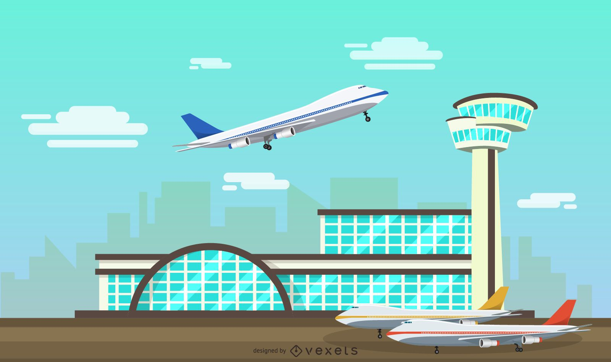
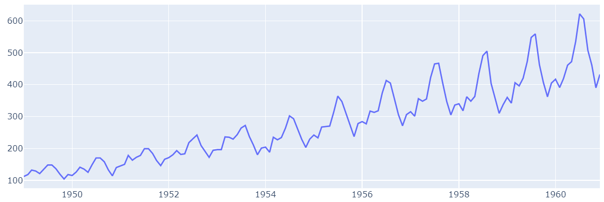
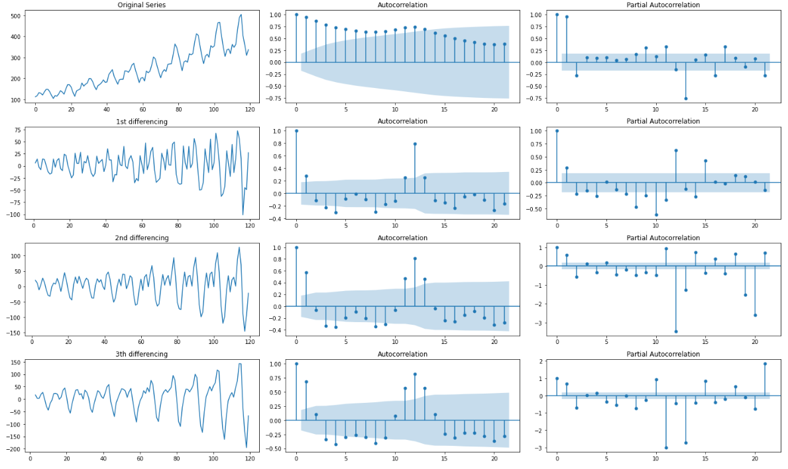
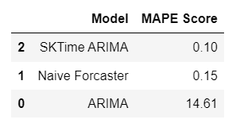

# Predict Number of Passangers at Airport using Time Series

On this project, i want to share how to use visitor history to get more insight for business decision. To get that insight, i use algortihm to predict number of passangers who will visit the airport using ARIMA & SARIMAX method (Time Series).

 
For full report of this project, please visit <a href="https://github.com/Juantonios1/Predict-Number-of-Passangers-at-Airport-using-Time-Series/blob/main/Prediction%20Number%20of%20Passengers%20Ipynb/Air%20Passengers%20Analysis.ipynb">Predict Number of Passangers at Airport using Time Series</a>.

## Summary Process
<!-- TABLE OF CONTENTS -->

  
Table of Content

  <ol>
    <li><a href="#business-background">Business Background</a></li>
    <li><a href="#data-understanding">Data Understanding</a></li>
    <li><a href="#exploratory-data-analysis">Exploratory Data Analysis</a></li>
    <li><a href="#modeling">Modeling</a></li>
    <li><a href="#conclusion">Conclusion and Recommendation</a></li>
    <li><a href="#contributors">Contributors</a></li>
  </ol>

## Business Background
**Context :**  
Airport retailing has become a popular concept in the last few years. Often called travel retail (which takes place mostly but not entirely in an airport), it has become one of the important strategies of companies planning to promote and create awareness about their brand. Airports where airfares are low are not able to generate high revenue from aeronautical business. Therefore, they shift to non-aeronautical businesses such as retail shops, restaurant, bars, and cafeterias. Airport retailing can also include services such as hotels, nursing homes, car rental outlets, banks, exchange offices, drugstores, and other stores such as jewelry, books and magazines, gifts and crafts, clothing & accessories, convenience stores, optics, perfumes, and souvenirs.

**Problem Statement :**  
In order to efficiently compete in the market and create value proposition, retailers are engaged in extensive research to collect data related to flight schedules, number of passengers in the flight, and location. The data is expected to help retailers keep check of their warehouses, adopt price skimming strategies, and conduct promotional activities to create strong customer base.

**Goals :**  
Predict the number of passengers who visiting the airport so retailer can recalculate the cost to optimize budget and make good decision on their business.

## Data Understanding

| Feature      	     | Description                                                      |
|--------------------|------------------------------------------------------------------|
| Month        	     | Month of activity of passengers on airport.                      |
| Passangers         | Number of passengers.                          	                |

This Dataset contain passengers traffic from year 1949 untill 1960

## Exploratory Data Analysis
At this stage, a brief analysis of the data will be carried out, as follows:
* Distribution Data
* Identify Outliers
* Identify Missing Value
* Data Pattern

## Modeling
At this stage will be done making and optimizing the deep learning model, as follows:
* ARIMA Univariate.
* SKTime Univariate.
  * Naive Forcester.
  * SARIMAX.

## Conclusion 
We conclude our result and give recommendation based on it
* Summary Model  
   
* Business Insight
  * The passengers traffic shows a strong increasing trend.
  * July-August have the highest number of customers on every year.
  * On 1961, August will have the highest number of customers with 702 visitors with standard error for 88 people.
  * The average of number of customers on 1961 are 523 people.
  
* Recommendation
  * It good to make more investment because customer still increase next year.
  * Retailer need more stocks on July untill August.

For full report of this project, please visit <a href="https://github.com/Juantonios1/Predict-Number-of-Passangers-at-Airport-using-Time-Series/blob/main/Prediction%20Number%20of%20Passengers%20Ipynb/Air%20Passengers%20Analysis.ipynb">Predict Number of Passangers at Airport using Time Series</a>.

## Contributors:
Juan Antonio Suwardi - antonio.juan.suwardi@gmail.com  
